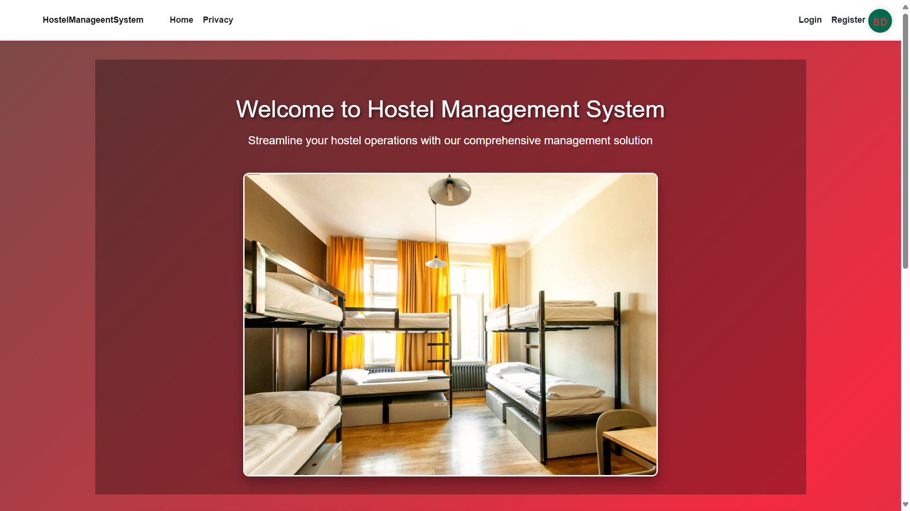
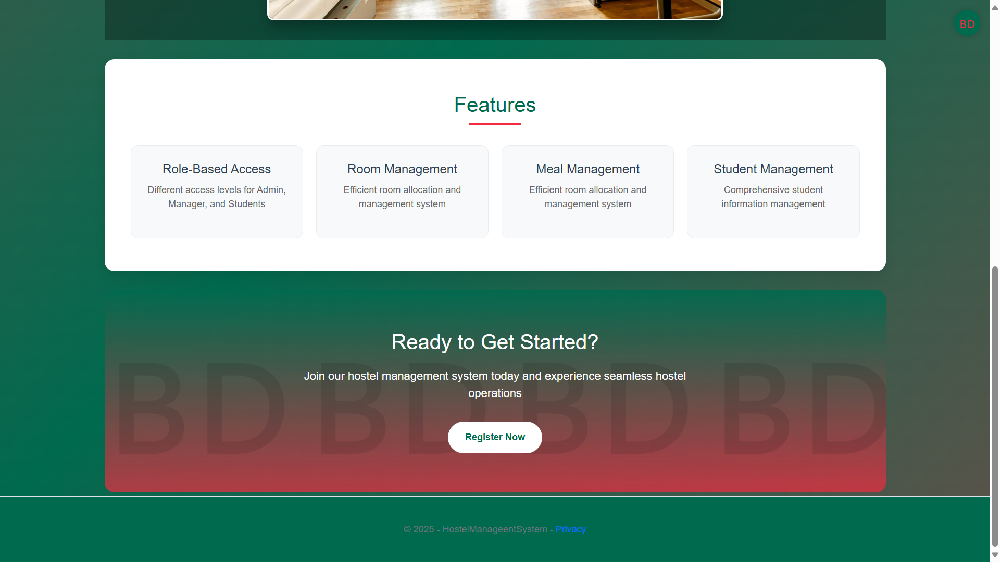
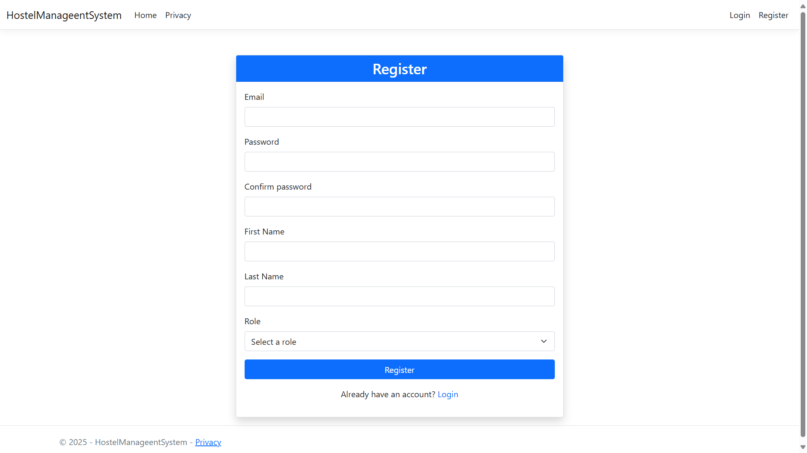
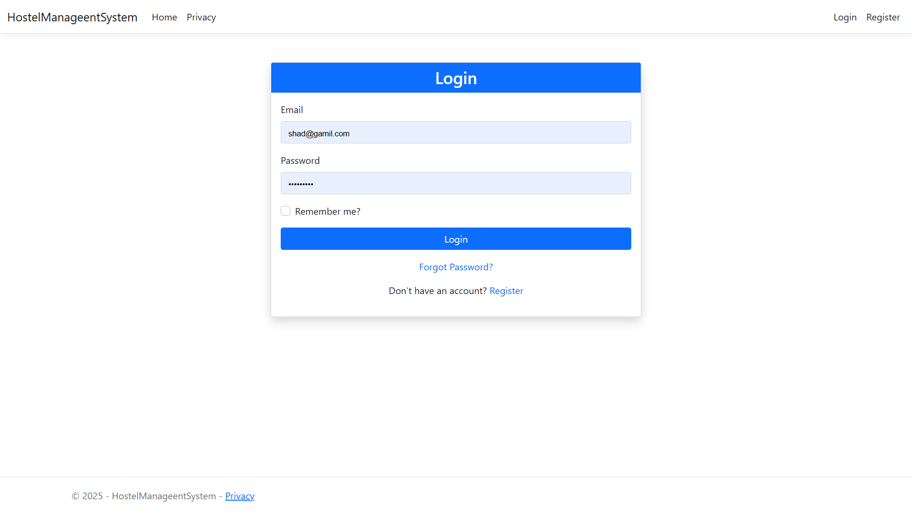
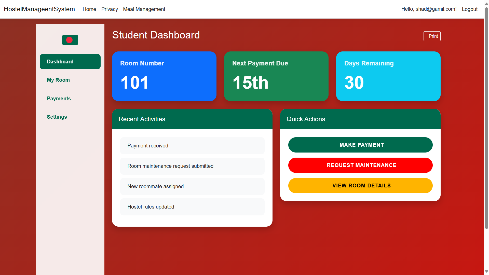
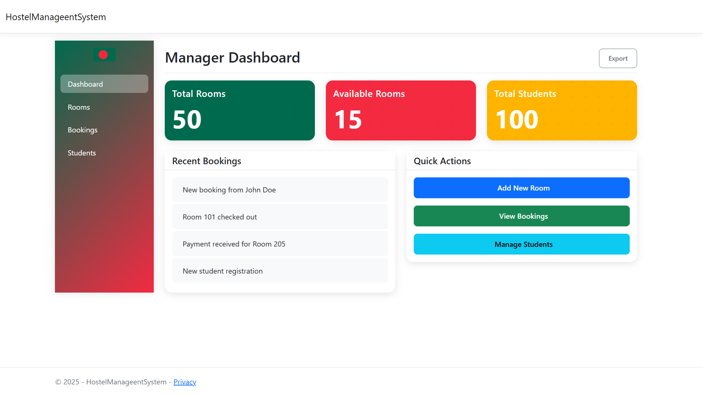
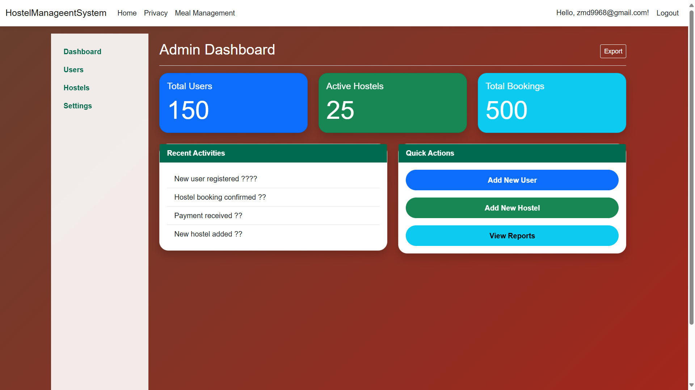

# 🏠 Hostel Management System

A modern, web-based Hostel Management System built with ASP.NET Core, featuring a beautiful Bangladeshi-themed UI design. This system helps manage student accommodations, room allocations, payments, and administrative tasks efficiently.

## 📸 Screenshots

### HomePage





### Register


### Key Features
| Feature | Screenshot |
|---------|------------|
| Login System |  |
| Student Dashboard |  |
| Manager Dashboard |  |
| Admin Dashboard |  |

## ✨ Features

### For Students
- 🏡 Modern dashboard with room information
- 💰 Easy payment management
- 🔧 Maintenance request system
- 📝 View room details and history
- 👥 Roommate information

### For Managers
- 📊 Comprehensive dashboard
- 🛏️ Room management
- 📅 Booking oversight
- 👥 Student management
- 📈 Occupancy tracking

### For Administrators
- 👤 User management
- 🏢 Multiple hostel management
- 📊 Analytics and reporting
- ⚙️ System configuration
- 🔐 Role-based access control

## 🚀 Technology Stack

- **Backend**: ASP.NET Core 8.0
- **Database**: MySQL with Entity Framework Core
- **Frontend**: 
  - Bootstrap 5
  - Modern CSS with animations
  - Font Awesome icons
- **Authentication**: ASP.NET Core Identity
- **Security Features**:
  - JWT Authentication
  - Role-based authorization
  - Secure password handling

## 🛠️ Setup Instructions

1. **Prerequisites**
   ```bash
   - .NET 8.0 SDK
   - MySQL Server
   - Visual Studio 2022 or VS Code
   ```

2. **Clone the Repository**
   ```bash
   git clone https://github.com/CodeByMoheb/HostelManageentSystem.git
   cd HostelManageentSystem
   ```

3. **Database Setup**
   ```bash
   dotnet ef database update
   ```

4. **Run the Application**
   ```bash
   dotnet run
   ```

5. **Access the Application**
   - Open your browser and navigate to `http://localhost:5000`
   - Default admin credentials:
     - Username: admin@hostel.com
     - Password: Admin123!

## 🎨 Design Features

- 🇧🇩 Bangladeshi cultural elements integration
- 🌈 Dynamic gradient backgrounds
- ✨ Smooth animations and transitions
- 📱 Fully responsive design
- 🖼️ Modern card layouts
- 🎯 Intuitive navigation

## 🔄 Current Status

The system currently includes:
- User authentication and authorization
- Dashboard for all user types
- Basic room management
- Payment tracking
- Maintenance request system

## 🚀 Future Updates

### Phase 1 (Q3 2024)
- [ ] Mobile application development
- [ ] Advanced payment gateway integration
- [ ] Real-time notifications system
- [ ] Chat system for student-manager communication

### Phase 2 (Q4 2024)
- [ ] AI-powered room allocation system
- [ ] Biometric authentication integration
- [ ] Advanced analytics dashboard
- [ ] Multi-language support

### Phase 3 (Q1 2025)
- [ ] IoT integration for smart room management
- [ ] Predictive maintenance system
- [ ] Virtual tour feature
- [ ] Mobile app for maintenance staff

## 👥 Contributing

We welcome contributions! Please follow these steps:

1. Fork the repository
2. Create a feature branch
3. Commit your changes
4. Push to the branch
5. Create a Pull Request

## 📝 License

This project is licensed under the MIT License - see the [LICENSE](LICENSE) file for details.

## 📞 Contact

For any queries or support, please contact:
- Email: your.email@example.com
- Website: [Your Website](https://yourwebsite.com)

## 🙏 Acknowledgments

- Special thanks to all contributors
- Bootstrap team for the amazing framework
- Font Awesome for the beautiful icons
- ASP.NET Core team for the robust framework

---
Made with ❤️ in Bangladesh 🇧🇩
